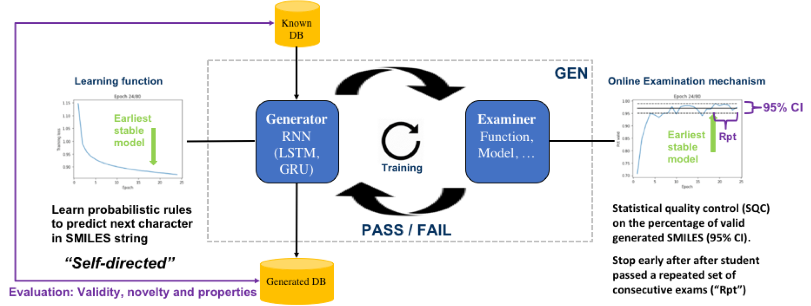

# Smiles-GEN
This project contains the code used for the generation of SMILES using the published method Smiles-GEN and has been published in the manuscript "GEN: Highly Efficient SMILES Explorer Using Autodidactic Generative Examination Networks" (doi:10.26434/chemrxiv.9791576)

## Reference
On using code for SMILES or modification for other text-based learning please refer to the original publication.

Please cite the following publication for any use of code or any parts thereof (including use of custom layers).

"GEN: Highly Efficient SMILES Explorer Using Autodidactic Generative Examination Networks"

Ruud van Deursena, Peter Ertlb, Igor Tetkoc and Guillaume Godina

a Firmenich SA, Research and Development, Rue des Jeunes 1, CH-1227 Les Acacias, Geneva, Switzerland

b Novartis Institutes for BioMedical Research, Novartis Campus, CH-4056 Basel, Switzerland

c BIGCHEM GmbH  and Institute of Structural Biology, Helmholtz Zentrum München - German Research Center for Environmental Health (GmbH),  Ingolstädter Landstraße 1,  D-85764 Neuherberg, Germany

Link to the publication(s): https://arxiv.org/abs/1909.04825 and/or https://chemrxiv.org/articles/GEN_Highly_Efficient_SMILES_Explorer_Using_Autodidactic_Generative_Examination_Networks/9796874

## License
The code is freely available under a Clause-3 BSD license (https://opensource.org/licenses/BSD-3-Clause).

## Dependencies

* Python 3.6
* RDKit
* Keras
* Tensorflow
* Numpy
* Scipy
* IPython
* Matplotlib
